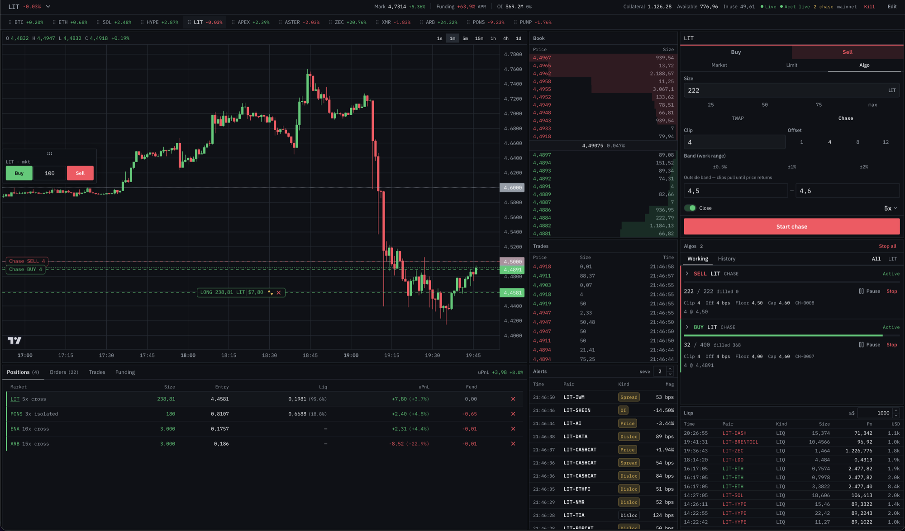

# Mayedge

Personal perp trading desk — Python backend + React frontend. Lighter only.



Personal software, not a product. There is no login: anyone who can reach the HTTP port can trade. Not financial advice.

Production is a VPS with **Tailscale Serve only**. Setup, ACL, and checks: **[deploy/README.md](deploy/README.md)**.

```bash
cp backend/.env.example backend/.env   # fill keys if trading
make push-env
make deploy
make check
```

Compose publishes `127.0.0.1:14200` (not `0.0.0.0`). Do not Funnel. Do not expose `:14200` on the public NIC.

**Local dev:** `uv run mayedge` binds `127.0.0.1:8000`; Vite proxies `/api` and `/ws`. Or `make up` for the same Docker image as production.

## Quick start (local dev)

### Backend

```bash
cd backend
cp .env.example .env
# Optional: add LIGHTER_ACCOUNT_INDEX, LIGHTER_API_KEY_INDEX (2-254), LIGHTER_API_PRIVATE_KEY
uv sync
uv run mayedge
```

API runs at `http://127.0.0.1:8000`. Public market data works without credentials.

### Frontend

```bash
cd web
npm install
npm run dev
```

Open `http://localhost:5173`.

## Features

- Resizable mosaic dashboard (chart, order book, trades, ticket, positions, algos)
- Live market data via exchange WebSocket fan-out
- Market / limit / TWAP / chase-iceberg orders
- Chase-iceberg algo with start / pause / stop; kill switch stops **all algos** then cancels
- Lighter testnet/mainnet via `LIGHTER_NETWORK` in backend `.env`

## API key setup (Lighter)

Use the [lighter-python examples](https://github.com/elliottech/lighter-python/blob/main/examples/README.md) `system_setup.py` with API key index **2–254** (not 0/1, reserved for the official app).

## Notes

- Chase jobs persist in SQLite. On shutdown, venue clips are **pulled**; on restart the parent **auto-resumes quoting** once market and account feeds are healthy (remaining qty is the source of truth). Dirty crash leftovers are pulled on boot; Resume/restore credit REST trades before quoting.
- Docker publishes `127.0.0.1:14200` → app `:8000` (API, `/ws`, and the SPA). Remote access is Tailscale Serve.

## Algos

### Chase iceberg

Accumulate or distribute via one-sided post-only clips behind the touch. Amends in place (no cancel+replace). Pulls clips when the book or account feed is unhealthy or price leaves your band. Stops when the parent size is filled.

## License

MIT. See [LICENSE](LICENSE).
